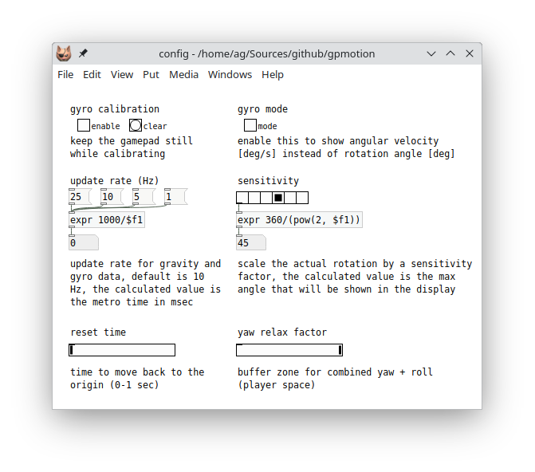

# gyroscope

Albert Gräf \<<aggraef@gmail.com>\>, 2024-11-18

Some game controllers and many smartphones have sensors for detecting orientation and angular movement in 3-dimensional space, so-called inertial measurement units, better known as *gyroscopes*. joyosc (when invoked with the `-s` option) and TouchOSC (with scripting) can read the motion data of a device and convert it to OSC data. In joyosc, motion data is converted to `accel` and `gyro` data, each with 3 values (x, y, z). The accelerometer data (`accel`) measures acceleration in m/sec^2. This normally includes an acceleration counteracting gravity at 9.81 m/sec^2, so that it is possible to determine the orientation of the device relative to the ground. The angular movement data (`gyro`) measures rotation in radians/sec.

In order to correctly interpret this data, it is important to know the coordinate systems being used, which is where gamepads and smartphones differ.

## Gamepads

The principal plane of the device is the x-z plane, with the *z axis* pointing towards you, and the *y axis* pointing upwards, so if the device lies flat on a table, the *y acceleration* value will be positive, matching the value of gravity (at 9.81 m/sec^2). Note that if you hold the device upright, the *z acceleration* value will be *negative* (at -9.81 m/sec^2), as the z axis will then point downwards. In contrast, if the device is upright, but with its *left* side pointing towards the ground, the *x acceleration* value will be *positive* (at 9.81 m/sec^2).

## Smartphones

On modern smartphones, the principal plane of the device typically is the x-y plane, with the *y axis* pointing away from you, and the *z axis* pointing upwards, so if the device lies flat on a table, the *z acceleration* value will be positive, matching the value of gravity (at 9.81 m/sec^2). If the device is upright, the *y acceleration* value, in contrast to the case of a gamepad, will be *positive* (at 9.81 m/sec^2). If the device is upright, with its *left* side pointing towards the ground, the *x acceleration* value will also be positive (at 9.81 m/sec^2).

## Notes

- The somewhat quirky axis configuration of gamepads (with the y axis pointing upwards and the z axis pointing towards the player) apparently had its origin in the PlayStation controllers. This set the standard and is employed in games where gyroscope data is being used for aiming or moving the gamer's view. See the [Gyro (AKA Motion Controls) Beginners Guide](https://www.youtube.com/watch?v=rOybuNm9XR8) on YouTube for an introduction to the use of gyroscopes in 3D computer games.
- Another point worth mentioning is that the so-called *gravity vector* with a magnitude of 9.81 m/sec^2 included in the accelerometer readings is pointing *upwards* (away from the Earth's center). At first this might seem counter-intuitive, but the rationale here is that the device needs to be accelerated *away* from the Earth's center so that it doesn't fall to the ground. So there is a force being applied to the object counteracting the force of gravity, and this is what is included in the accelerometer data.
- Whether in Pd or in computer games, raw gyroscope data is hard to use, and its quality, precision, and update rate will vary with the device at hand. Therefore, for most applications you will have to process the data in some way, in particular, to smooth it out and to determine the device's gravity vector and thereby its orientation in 3D space. Fortunately, there are algorithms for that which have been developed for use in computer games. See the [gyrowiki](http://gyrowiki.jibbsmart.com/) by [Jibb Smart](https://www.jibbsmart.com/) (of Fortnite fame) for details.
- While many smartphones have gyroscopes these days, many game controllers don't, or may only provide the data to certain host devices. Xbox-compatible controllers usually come without gyros, because Microsoft's game controller APIs don't support that kind of data. However, the [SDL library](https://github.com/libsdl-org/SDL), which is being used by [joyosc](https://github.com/danomatika/joyosc), [TouchOSC](https://hexler.net/touchosc), and many other programs, does support motion data. Controllers generally have gyroscopes if they support the Nintendo Switch or the SONY PlayStation gaming consoles. Examples of these are the the Nintendo Switch Pro and the PlayStation DualShock and DualSense controllers, for which many 3rd party compatible devices are available. Other examples at the time of this writing are the 8bitdo Pro 2 and Ultimate Bluetooth & 2.4g, the GameSir Nova (*not* the Nova Light), Cyclone, and Cyclone Pro, and the Gulikit KK3 controllers.

## Examples

The toplevel directory contains the following Pd patches for testing purposes. The patches take OSC (not gamepad) input in the format provided by [joyosc](https://github.com/danomatika/joyosc). Alternatively, you can also use [TouchOSC](https://hexler.net/touchosc) with the provided template (see below).

- The controller-test.pd patch provides a simple way to show the raw gyroscope data produced by `joyosc -s`, along with button presses, joystick axes, and touchpad data (if available).
- A much more advanced version of this patch is available in gpmotion-help.pd. This processes the gyroscope data using Jibb Smart's algorithm mentioned above which calculates gravity and accumulated or sampled rotation data from the raw sensor inputs, please see the [gyrowiki](http://gyrowiki.jibbsmart.com/) for details. Also note that this patch requires the gpmotion external which first needs to be compiled before the patch will work. Running `make` will usually do the trick; check the toplevel README file for details.
- The TouchOSC (mk2) template joyosc.tosc can be used on Android and iOS devices to emulate a game controller including gyroscope data from the device (turn on the corresponding toggle in the template). It produces OSC data compatible with that of the joyosc program, so it can be used with the controller-test.pd and gpmotion-help.pd patches in lieu of a real gamepad. The template has been set up to work in portrait mode and remaps the axes so that it provides the same kind of sensor data as a gamepad.

See below for some information on how to get started with the example patches.

## Usage

It's a good idea to start with the controller-test.pd patch because it's simpler and provides a quick check to see whether your device provides the required sensor data. Here is how that patch looks like:

With the gamepad connected to your computer and `joyosc -s` running in the background, check the `poll` toggle to start receiving data from the device. You can press the buttons and triggers, move the joysticks, and swipe across the touchpad on the device to test that the device is connected and all its parts are working as expected.

Next, check the toggle above the `sensor` subpatch to enable the processing of motion (accelerometer and gyroscope) data. If all is well, you should see x y z data in both the `accel` and `gyro` listboxes, as shown in the screenshot above. This is the raw sensor data as received by joyosc through the SDL library, thus the readings will be in m/sec^2 for the acceleration and radians/sec for the gyroscope data.

If you see no sensor output or just a bunch of zeros then you're out of luck; your device doesn't produce the sensor data required by the gpmotion-help.pd patch. (But check the user guide of your gamepad to see if it can be switched into a mode that will generate motion data.)

The same procedure will also work with the included joyosc.tosc template running on an Android or iOS device. Just make sure that you have an OSC connection set up which connects to your computer's IP address and (send) port 8880 (which matches joyosc's default output port). The receive port can be left empty or you can set it to port 7770 (which matches joyosc's default input port).

### gpmotion

After having verified that your gamepad or mobile device works with the controller-test.pd patch, it's time to kick the tires and check out the gpmotion-help.pd patch:

This shares the basic elements with the controller-test.pd patch. So you first check the `poll` toggle to enable the OSC connection, then the `motion` toggle to receive motion data. But the patch also provides a bunch of new features. In particular, here the `motion` subpatch contains an instance of the `gpmotion` object which processes the raw motion data using Jibb Smart's algorithm. The patch then presents this data in different ways:

- **gravity**: This shows the gravity vector pointing downwards (i.e., towards the center of the Earth) which is contained in the accelerometer data and provides a quick way to check the orientation of the device.
- **local space**: This shows the pitch-yaw-roll data relative to the orientation of the device (as determined by the gravity vector).
- **world** and **player space**: These each use pitch with a combination of yaw and roll relative to the gravity vector, but in different ways. These are usually preferred for gamepads, while local space usually works better with mobile devices. See the [gyrowiki](http://gyrowiki.jibbsmart.com/) for details.

Please note that in the help patch, only one of the spaces can be shown at any time. You can switch between spaces with the messages `gravity`, `local`, etc. The actual data is shown in the listbox near the bottom of the patch; since these numbers will change very quickly, you can engage the `freeze` toggle to have a good look at the current sample at any time. The same data is also shown in a visual form with the sliders on the right.

Also note that while the `gpmotion` object accepts motion data in m/sec^2 and radians/sec units, as provided in the OSC input, it *outputs* data in g (1 g = 9.81 m/sec^2) and degrees/sec units. This is the data shown in the listbox. In addition, the local, world, and player space values in the sliders have all been *normalized* to the -1 ... +1 range, and are *scaled* by having a sensitivity setting applied to them, which can be set in the `config` subpatch; more on that below.

The listbox and the sliders each have their own *receiver symbols* which you can use in a secondary patch to post-process the data in any desired way, e.g., to synthesize sounds. These are:

- `data`: The processed sensor data (gravity, local space, etc.) from the `gpmotion` object shown in the listbox. These are lists of two or three elements (x y z for gravity, x=pitch y=yaw z=roll for local, and x=pitch y=yaw+roll for world and player space).
- `gravx`, `gravy`, `gravz`: The data from the `gravity` sliders.
- `locx`, `locy`, `locz`: The normalized and scaled data from the `local space` sliders.
- `wrldx`, `wrldy`: The normalized and scaled data from the `world space` sliders.
- `plyrx`, `plyry`: The normalized and scaled data from the `player space` sliders.

#### Configuration

Various options can be adjusted in the `config` subpatch at the bottom of the patch:

**Calibration**: If needed, you can calibrate the gyroscope as follows: Make sure that the device is in neutral position (e.g., flat on a table), then check the `enable` toggle under `gyro calibration`, and after a short while uncheck the toggle again. The saved calibration data will also be printed in the Pd console so that you can check the result. You can also clear the calibration at any time with the `clear` button.

**Gyro mode**: The `gyro mode` option, when checked, will show momentary angular velocity instead of accumulated rotation values.

**Update rate**: The update rate for the processed sensor data can adjusted as needed, the default being an update rate of 10 Hz (a.k.a. one sample each 100 msec) which should be good enough for many purposes. If you have a reasonably fast computer then you might try to beef it up to 25 Hz, or use the 1 Hz setting for close inspection in "slow motion". In any case, the patch uses `line` to do a smooth transition between updates, so that all suggested values should work fine; it goes without saying, though, that with an update rate as low as 1 Hz the latency will be very noticeable. You can in fact set the rate to *any* positive value, but slower computers might struggle with higher update rates, so we recommend sticking to the suggested values unless you absolutely need to change the value to something completely different.

**Sensitivity**: The sensitivity of the local, world, and player space sliders to rotation can be adjusted with the `sensitivity` radio button which determines the scaling factor by which the actual rotation values are multiplied. The maximum angle in the display (which corresponds to the 1 value of the sliders) is shown in the numbox below. The radio buttons provide powers-of-2 scaling factors which correspond to maximum angles ranging from 2^0 a.k.a. 360° to 2^5 a.k.a. 11.25°. The default is 2^3 a.k.a. 45°.

**Reset time**: Set the time it takes to reset the local, world, or player space rotation to the origin (all zero angles) with the `reset` button in the main patch. The time ranges from 0 to 1 seconds. The default time is 0 which means that the rotation jumps back to the origin immediately. If the time is nonzero, the patch uses `line` to do a smooth transition, fading from the current rotation to the origin in the given time. During the fade further sensor input will be paused until the transition is done, at which point fader input resumes immediately.

**Yaw relax factor**: This setting only applies to player space. The `yaw relax factor` determines how far the device may be tilted in order to still have the combined yaw and roll value work as intended. The default (and maximum) value of 2 corresponds to 60° (= 90 − asin(1/2)) which matches the [JoyShockMapper](https://github.com/Electronicks/JoyShockMapper) default, while the minimum of 1.15 reduces the buffer zone to some 30°.

#### Shortcuts

For convenience, the patch also binds various frequently used configuration options to buttons on the device. The following table lists the currently available bindings; you can also find a short description of these in the patch itself.

| Button           | Function                                                     |
| ---------------- | ------------------------------------------------------------ |
| 🅰 or **⨯**       | Pause motion while pressed (useful to quickly realign the controller) |
| 🆇 or 🞐           | Turn the processing of motion data on or off                 |
| 🅱 or ⭘           | Freeze the data display (on or off)                          |
| Left stick       | Reset rotation to the origin (useful to recenter *after* realigning the controller) |
| Right stick      | Turn gyro mode on or off (see [Configuration](#configuration) above) |
| Left bumper      | Turn calibration on or off (see [Configuration](#configuration) above) |
| Right bumper     | Clear calibration (see [Configuration](#configuration) above) |
| D-Pad up/down    | Cycle through the different spaces (gravity, local space, etc.) |
| D-Pad left/right | Adjust sensitivity (see [Configuration](#configuration) above) |
